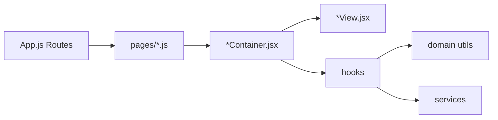

# Архитектурна карта: InvoicerApp

Документът описва **как слоевете се подреждат** и **кои файлове с кого говорят**. Полезно е като „карта на града“, не като изчерпателен списък на всеки импорт.

---

## 1. Четири слоя (референция)

| Слой | Роля | Типични места |
|------|------|----------------|
| **UI** | Рендер по props, без Firestore и без бизнес правила за статус/права. | `*PageView.jsx`, `*FormView.jsx`, `components/*.jsx` (споделени) |
| **Контейнер / оркестрация** | Събира hooks, state, навигация; подава готови props към View. | `*Container.jsx`, понякога **страница** в `pages/*.js` само препраща към контейнер. |
| **Hooks** | React логика: ефекти, `useCallback`, връзка към services; често вика **domain** преди/след I/O. | `features/*/hooks/*.js` |
| **Domain** | Чисти функции: статуси, суми, правила — **без** React и **без** мрежа. | `src/utils/invoiceLifecycle.js`, `invoiceMetrics.js`, … и `features/*/domain/*.js` |
| **Service** | Firestore / Firebase / външни API — тънък I/O слой. | `features/*/services/*.js` |

**Правило за посока:** UI → Container (+ hooks) → Domain (по желание) → Service. Domain **не** вика services; services **не** рендерират UI.

---

## 2. Вход: маршрут → страница → контейнер → view

`src/App.js` дефинира маршрутите. Страниците в `src/pages/*.js` са тънки „врати“ към feature контейнери (освен **Home**, който директно експортира контейнера).

### Таблица по маршрут

| URL (основни) | Страница `pages/` | Контейнер | Преглед (View) |
|---------------|-------------------|------------|----------------|
| `/` | `Home.js` → **директно** `HomeContainer` | `features/home/HomeContainer.jsx` | `HomePage.jsx` |
| `/login` | `Auth.js` | `features/auth/AuthContainer.jsx` | `AuthView.jsx` |
| `/dashboard` | `Dashboard.js` | `DashboardPageContainer.jsx` | `DashboardPageView.jsx` |
| `/invoices` | `Invoices.js` | `InvoicesPageContainer.jsx` | `InvoicesPageView.jsx` |
| `/invoices/new`, `/new/invoice/:invoiceId` | `CreateInvoice.js` | `CreateInvoiceFormContainer.jsx` | `CreateInvoiceFormView.jsx` |
| `/invoices/:id` | `ViewInvoice.js` | `ViewInvoiceContainer.jsx` | `ViewInvoicePage.jsx` |
| `/products` | `Products.js` | `ProductsPageContainer.jsx` | `ProductsPageView.jsx` |
| `/customers` | `Customers.js` | `CustomersPageContainer.jsx` | `CustomersPageView.jsx` |
| `/profile` | `SetupProfile.js` | `SetupProfilePageContainer.jsx` | `SetupProfilePageView.jsx` |

Обвивка за автентикирани страници: `PrivateRoute` → `AppShell` (layout + sidebar), после горният ред.

---

## 3. Споделен domain (`src/utils/`)

Това е **глобалният** домейн за фактури и таблици; не е под конкретен feature folder.

| Файл | Отговорност |
|------|----------------|
| `invoiceLifecycle.js` | Статуси (`INVOICE_STATUS`), нормализация, права (`canEdit…`, `canDelete…`), badge/persist UI config, етикети за статус. |
| `invoiceMetrics.js` | Суми по редове (`computeInvoiceGrandTotalNumber`, …). |
| `invoiceTableRows.js` | Подготовка на редове за `Table` (дати, badge, сума, **presentation** за status badge). |
| `invoiceLineNet.js` | Нето/ДДС по ред. |
| `invoiceIssueDateMs.js` | Парсване на дата за филтри/метрики. |

**Кой ги ползва:** hooks (`useInvoicePersistence`, `useInvoiceRowActions`), `CreateInvoiceFormContainer`, `dashboard/domain/calculateRevenue.js`, `invoiceTableRows.js`, контейнери за преглед на фактура и др.

---

## 4. Feature domain (само в модул)

| Модул | Файл | Отговорност |
|-------|------|-------------|
| Табло | `features/dashboard/domain/calculateMetrics.js` | Мост към приходи. |
| Табло | `features/dashboard/domain/calculateRevenue.js` | Месечни суми, броене issued/paid — вътре ползва `invoiceLifecycle` + `invoiceMetrics`. |

---

## 5. Services по feature (I/O)

| Feature | Service файлове | Какво правят (накратко) |
|---------|-----------------|-------------------------|
| Фактура (create/view споделят) | `invoice-create/services/invoiceService.js` | CRUD фактури, mark paid, номерация. |
| Фактура | `invoice-create/services/businessService.js`, `productService.js` | Бизнес документи, продукти за формата. |
| Табло | `dashboard/services/dashboardService.js` | Абонамент + `buildDashboardViewModel` (нормализация на бизнес + извикване на domain метрики). |
| Табло | `dashboard/services/invoicesService.js`, `businessService.js` | Firestore потоци за таблото. |
| Клиенти | `customers/services/customersService.js` | Клиенти в Firestore. |
| Продукти | `products/services/productsService.js` | Продукти в Firestore. |
| Профил | `setup-profile/services/businessService.js`, `logoService.js` | Профил, лого. |

**Забележка:** `ViewInvoiceContainer` вика `markInvoicePaid` от **`invoice-create/services/invoiceService.js`** — споделена услуга между „създай“ и „преглед“.

---

## 6. Примерни потоци (край до край)

### A) Табло — метрики и списък

1. `DashboardPageContainer` → `useDashboard` (hook).
2. `useDashboard` → `dashboardService.subscribeDashboard` + `buildDashboardViewModel`.
3. `buildDashboardViewModel` → **`calculateDashboardMetrics`** → **`calculateMonthlyRevenue`** (feature domain).
4. `calculateMonthlyRevenue` → **`invoiceLifecycle`** + **`invoiceMetrics`** (споделен domain).
5. `DashboardPageView` получава готови числа/етикети; за таблица: `buildInvoiceTableRows` (utils) във View или hook — редовете са „готови за UI“.
6. За действия по ред: `DashboardActionsSvg` + **`useInvoiceRowActions`** → domain проверки → **`invoiceService`**.

### B) Създаване / редакция на фактура

1. `CreateInvoiceFormContainer` — state, форма, **`getInvoiceEditorPersistUiConfig`** от `invoiceLifecycle` (без клонене по статус в контейнера).
2. Много **`invoice-create/hooks/*`**: hydration, persist, items, totals…  
   - Persist: `useInvoicePersistence` → **`getInvoicePersistBlockReason`** / **`getInvoicePersistSuccessKind`** → `usePersistDraftInvoice` / `usePersistIssuedInvoice` → **`invoiceService`**.
3. `CreateInvoiceFormView` — само UI по props.

### C) Преглед на фактура

1. `ViewInvoiceContainer` → `useInvoiceData` / `useBusinessData` (hooks към services или Firestore helpers).
2. Domain: `getInvoiceStatusBadgePresentation`, `canMarkInvoicePaid`, `isInvoiceLifecyclePaid` — в контейнера, после props към **`ViewInvoicePage`**.
3. Печат: `ComponentToPrint` (UI под контейнера).

### D) Продукти / клиенти

1. `*PageContainer` — delete диалог state, викане на **`productsService` / `customersService`**.
2. `*PageView` — `onRequestDelete`, модал, таблица.

---

## 7. Споделени UI компоненти (между модули)

| Компонент | Къде се ползва | Забележка |
|-----------|----------------|-----------|
| `Table.js` | Списък фактури, табло | Очаква **готови** `rows` (вкл. `statusBadge` от domain през `invoiceTableRows`). |
| `InvoiceStatusBadge.jsx` | Табло/списък, преглед | Получава **`label` + `statusTone`** — подготвени отгоре през `getInvoiceStatusBadgePresentation`. |
| `DashboardActionsSvg.jsx` | В `Table` | „Глупав“ UI; логика от **`useInvoiceRowActions`**. |
| `AppShell`, `Sidebar`, `PrivateRoute` | Цяло приложение | Маршрутизация и layout. |

---

## 8. Контекст и глобално състояние

| Нещо | Файл / място | Роля |
|------|----------------|------|
| Готовност за нова фактура | `contexts/InvoiceCreationReadyContext` | Табло/контейнери знаят дали може „нова фактура“. |
| Redux | Използва се в create invoice flow (напр. persist) | Не е основният източник на данни; детайлите са в съответните hooks. |

---

## 9. Структура на папка `features/` (логика)

Всеки модул обикновено има:

- `components/` — View и по-малки UI части  
- `*Container.jsx` или `containers/` — оркестрация  
- `hooks/` — връзка React ↔ services ↔ domain  
- `services/` — Firestore/API  
- понякога `domain/` — само за този модул (табло)

`invoice-view` споделя услуги с `invoice-create` за операции върху съществуваща фактура.

---

## 10. Как да четеш един модул бързо

1. Отвори **страницата** в `pages/X.js` — виж кой **Container** се рендерира.  
2. В **Container** — виж кои **hooks** се викат и какви **props** отиват към **View**.  
3. В **hook** — проследи: **domain** (`utils/` или `features/.../domain/`) преди **service**.  
4. В **View** — само props и layout; ако виждаш `INVOICE_STATUS` или Firestore, обикновено е изключение или техен дълг.

---

## 11. Свързани документи

- `docs/architecture-ui-container-state.md` — одит: какво е по „чистия“ модел UI/container/domain и какво е останало като дълг.

---

_Картата е актуализирана спрямо структурата на репото; при големи рефактори я подновете с един преглед на `pages/`, `*Container` и `services/`._
